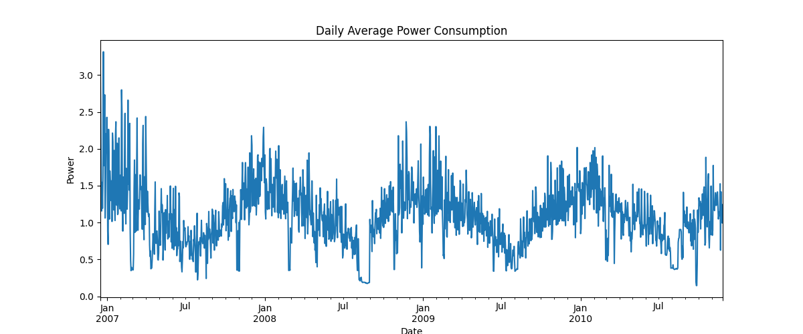
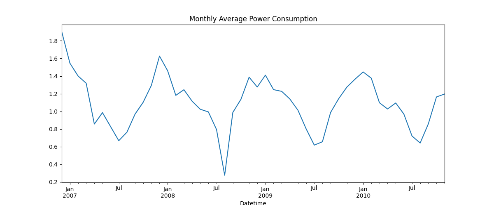
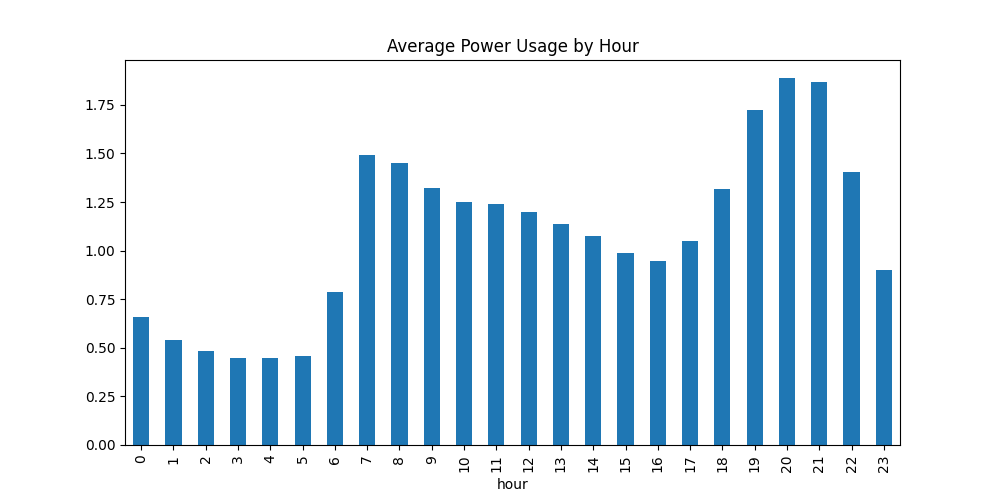
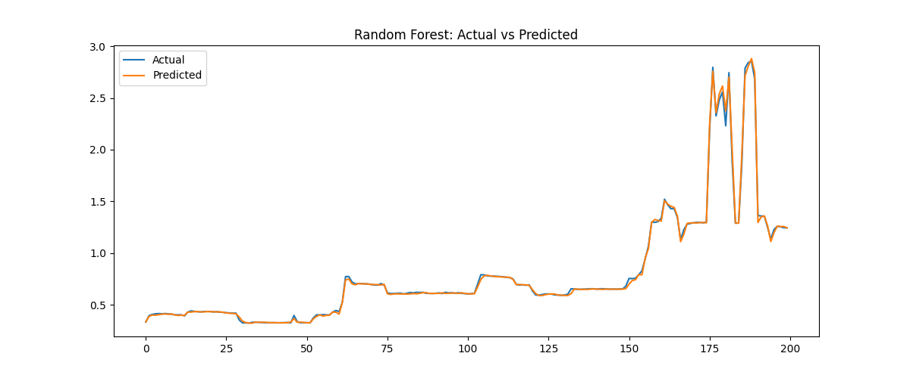

# ⚡ Smart Energy Consumption Analyzer

## 📌 Overview
This project analyzes and predicts household energy consumption using machine learning.

## 📸 Project Visuals

### 📊 Daily Trend

### 📈 Monthly Trend

### ⏰ Hourly Usage

### 🤖 Model Prediction

## 🚀 Features
- Data cleaning and preprocessing
- Time-series analysis
- Feature engineering (lag, rolling features)
- Machine learning models (Linear Regression, Random Forest)
- Interactive dashboard using Streamlit

## 📊 Insights
- Peak energy usage occurs during evening hours (7–10 PM)
- Clear seasonal trends observed in monthly consumption
- Energy usage is lowest during late night hours
- Data shows right-skewed distribution with occasional spikes

## 🤖 Model
- Linear Regression (baseline)
- Random Forest (optimized)

## 📈 Evaluation
- RMSE used for performance measurement
- Random Forest outperformed Linear Regression

## 🖥️ Dashboard
Run locally via bash:
streamlit run app.py

## 📂 Dataset
Dataset not included due to size limitations.
Download from:
https://archive.ics.uci.edu/ml/datasets/Individual+household+electric+power+consumption

## 🛠️ Tech Stack
Python
Pandas, NumPy
Matplotlib, Seaborn
Scikit-learn
Streamlit

## 📬 Contact
LinkedIn: https://www.linkedin.com/in/hridya-hirawat-b077722b6/
GitHub: https://github.com/HRIDYA03